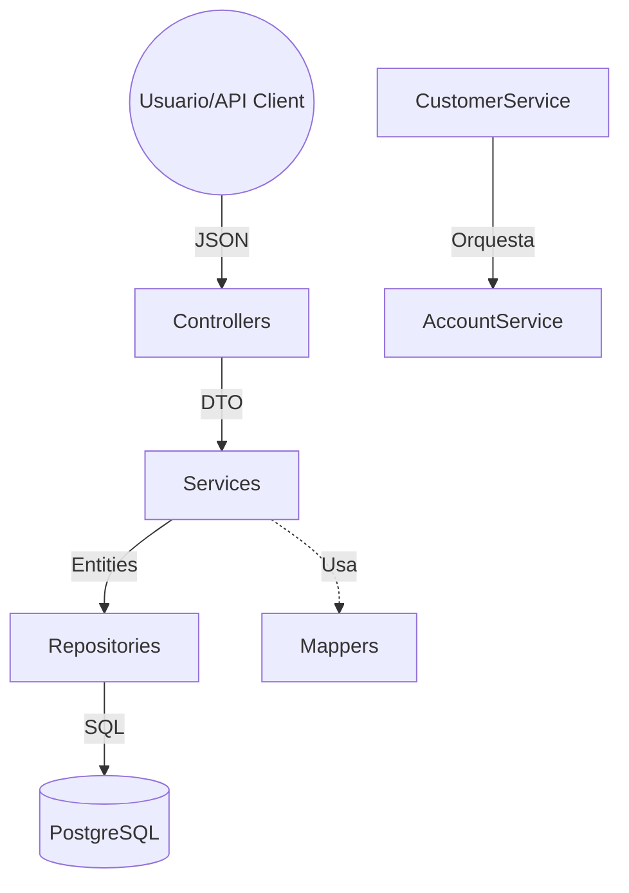

# Core Bank Project

Este proyecto es un sistema de **Core Bancario** desarrollado con Spring Boot, diseñado para simular operaciones financieras reales bajo una arquitectura **Monolítica Modular** limpia y escalable.

## 🏗 Arquitectura

El sistema sigue el patrón de **Capas (Layered Architecture)** para separar responsabilidades:

1.  **Controller (API Layer)**: Recibe las peticiones HTTP (JSON) y usa **DTOs** (Request/Response) para comunicarse con el exterior.
2.  **Service (Business Layer)**: Contiene la lógica de negocio (validaciones, cálculos, orquestación). Usa **Mappers** para convertir DTOs a Entidades.
3.  **Repository (Data Layer)**: Interactúa con la base de datos (PostgreSQL) usando Spring Data JPA.
4.  **Entity (Domain Layer)**: Representa las tablas de la base de datos.
5.  **DTO (Data Transfer Object)**: Objetos para el transporte de datos entre capas.

## 📊 Flujo de Datos y Arquitectura

## 📖 Documentación Interactiva (Swagger)

El proyecto cuenta con **Swagger UI** para explorar y probar los endpoints de forma interactiva.

*   **URL**: `http://localhost:8080/swagger-ui.html`
*   **Vistazo rápido**: Podrás ver los modelos de datos (DTOs) y ejecutar peticiones directamente desde el navegador.

## 🚀 Módulos y Funcionalidades Logradas

### 1. Customer (Clientes)
*   **Identidad**: Gestiona información personal con campos obligatorios y únicos (`name`, `email`, `documentId`).
*   **API**: Implementación total con DTOs y Mappers.
*   **Integración**: Al registrar un cliente, se dispara automáticamente la creación de su primera cuenta.

### 2. Account (Cuentas)
*   **Tipos**: Soporte para `SAVINGS` y `CHECKING` mediante Enums.
*   **Seguridad y Reglas**:
    *   Generación de números de cuenta únicos de **4 dígitos**.
    *   **Restricción de tiempo**: 5 días para Ahorros y 24 horas para Corrientes.
*   **Transaccionalidad**: Uso de `@Transactional` para asegurar la integridad registro-cuenta.

## 🚧 Tareas Pendientes

1.  **Dashboard de Cuenta**:
    *   [ ] Listar todas las cuentas de un cliente.
2.  **Módulo de Transacciones**:
    *   [ ] **Depósitos**: Carga de saldo autorizada.
    *   [ ] **Transferencias**: Lógica atómica con validación de saldo.
3.  **Seguridad Avanzada**:
    *   [ ] Implementar JWT y Roles de usuario.

## 🛠 Tecnologías
*   **Java 17**
*   **Spring Boot 3**
*   **Spring Data JPA**
*   **PostgreSQL**
*   **Lombok** & **Records** (Java 14+)
