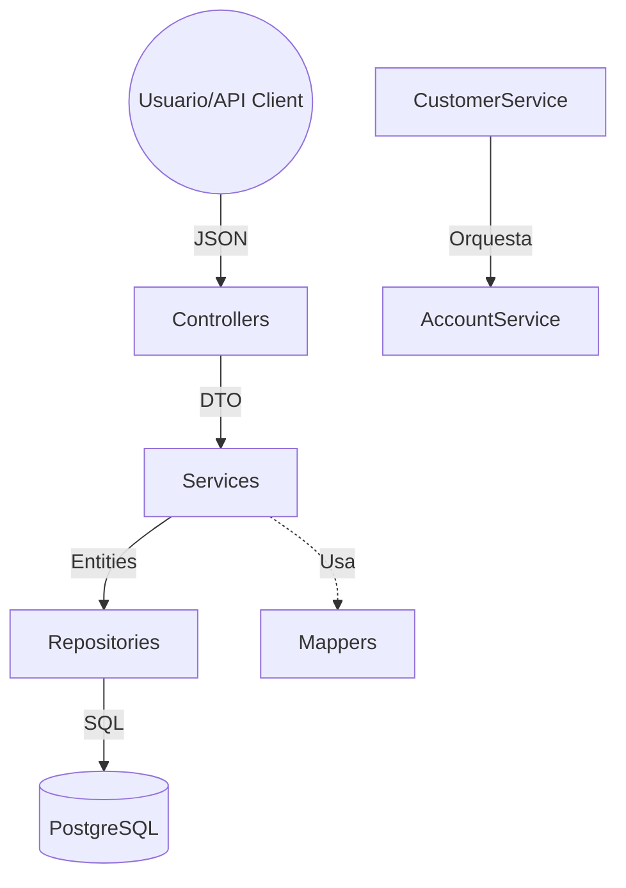

# Core Bank Project

Este proyecto es un sistema de **Core Bancario** desarrollado con Spring Boot, diseñado para simular operaciones financieras reales bajo una arquitectura **Monolítica Modular** limpia y escalable.

## 🏗 Arquitectura

El sistema sigue el patrón de **Capas (Layered Architecture)** para separar responsabilidades:

1.  **Controller (API Layer)**: Recibe las peticiones HTTP (JSON) y usa **DTOs** (Request/Response) para comunicarse con el exterior.
2.  **Service (Business Layer)**: Contiene la lógica de negocio (validaciones, cálculos, orquestación). Usa **Mappers** para convertir DTOs a Entidades.
3.  **Repository (Data Layer)**: Interactúa con la base de datos (PostgreSQL) usando Spring Data JPA.
4.  **Entity (Domain Layer)**: Representa las tablas de la base de datos.
5.  **DTO (Data Transfer Object)**: Objetos para el transporte de datos entre capas.

## 📊 Flujo de Datos y Arquitectura



## 📖 Documentación Interactiva (Swagger)

El proyecto cuenta con **Swagger UI** para explorar y probar los endpoints de forma interactiva.

*   **URL**: `http://localhost:8080/swagger-ui.html`
*   **Vistazo rápido**: Podrás ver los modelos de datos (DTOs) y ejecutar peticiones directamente desde el navegador.

## 🚀 Módulos y Funcionalidades Logradas

### 1. Customer (Clientes)
*   **Identidad**: Gestiona información personal con campos obligatorios y únicos (`name`, `email`, `documentId`).
*   **API**: Implementación total con DTOs y Mappers.
*   **Integración**: Al registrar un cliente, se dispara automáticamente la creación de su primera cuenta.

### 2. Account (Cuentas)
*   **Tipos**: Soporte para `SAVINGS` y `CHECKING` mediante Enums.
*   **Seguridad y Reglas**:
    *   Generación de números de cuenta únicos de **4 dígitos**.
    *   **Restricción de tiempo**: 5 días para Ahorros y 24 horas para Corrientes.
*   **Transaccionalidad**: Uso de `@Transactional` para asegurar la integridad registro-cuenta.

### 3. User & Auth (Seguridad)
*   **RBAC (Role Based Access Control)**: Diferenciación entre `ADMIN`, `TELLER` y `USER`.
*   **JWT (JSON Web Token)**: Implementación completa de autenticación stateless con Access y Refresh Tokens.
*   **BCrypt**: Encriptación profesional de contraseñas.
*   **Relación User-Customer**: Separación de credenciales (User) y datos de negocio (Customer) con vinculación `1:1`.

### 5. Políticas de Contraseñas Más Estrictas (Backend + Frontend)

#### Backend
*   **Validador centralizado**: `PasswordValidator` (Passay) validando en el flujo de registro antes de encriptar con BCrypt.
*   **Reglas de contraseña**:
    *   Longitud: **12 a 128** caracteres
    *   Al menos **1** mayúscula, **1** minúscula, **1** número y **1** carácter especial
    *   Sin espacios en blanco
    *   Bloqueo de secuencias comunes (teclado `qwerty` y secuencias numéricas)
*   **Excepción custom**: `InvalidPasswordException` (hereda de `BusinessException`).
*   **Validación declarativa**: `@Valid` en `AuthController` y anotaciones de Bean Validation en `RegisterRequest`/`LoginRequest`.
*   **Manejo consistente de errores (400)**:
    *   `BusinessException` => `400 BAD_REQUEST` con `message`
    *   `MethodArgumentNotValidException` => `400 BAD_REQUEST` con `message` y lista `errors[]` por campo

#### Frontend (banka-ui)
*   **Interpretación de errores del backend**:
    *   Se conserva `message` y, cuando aplica, el arreglo `errors[]`.
*   **UI de errores por campo**:
    *   En `Register` y `Login` se muestran mensajes debajo de cada input según `errors[]`.
    *   Si el error es general (ej. contraseña no cumple Passay), se muestra el `message` del backend.

## ▶️ Cómo correr el Frontend (banka-ui)

1. Instalar dependencias (solo la primera vez)

    ```bash
    cd banka-ui
    npm install
    ```

2. Levantar Vite

    ```bash
    npm run dev
    ```

3. Abrir en el navegador

    *   `http://localhost:5173`

4. Requisito

    *   Backend corriendo en `http://localhost:8080`

### 4. Admin & Teller Dashboard (Nuevo 🚀)
*   **Búsqueda Global**: Localización de clientes por email, nombre o número de cuenta.
*   **Operaciones de Caja**:
    *   **Depósitos**: Interfaz exclusiva para Cajeros/Admins para realizar ingresos.
    *   **Historial**: Visualización completa de movimientos de cualquier cuenta.
*   **Gestión de Estados**:
    *   **Bloqueo/Desbloqueo**: Funcionalidad para congelar cuentas instantáneamente.
    *   **Seguridad Reforzada**: El backend rechaza *cualquier* transacción (entrante o saliente) en cuentas bloqueadas.
*   **UI Reactiva**:
    *   Indicadores visuales de estado (Grayscale para cuentas bloqueadas).
    *   Botones de acción contextuales.

## 🛡 Roadmap y Próximos Pasos

1.  **Reportes Avanzados**: Exportación de extractos en PDF.
2.  **Notificaciones**: Alertas por email ante movimientos sospechosos.
3.  **Mejoras de Seguridad**:
    - [ ] Implementar políticas de contraseñas más estrictas
    - [ ] Agregar autenticación de dos factores (2FA)
    - [ ] Implementar flujo de recuperación de contraseña seguro
    - [ ] Añadir registro detallado de actividades de autenticación
    - [ ] Implementar rate limiting en endpoints sensibles
    - [ ] Añadir lista negra de tokens JWT
    - [ ] Mejorar mensajes de error para evitar fuga de información
    - [ ] Implementar detección de patrones sospechosos de inicio de sesión
    - [ ] Añadir verificación de correo electrónico en el registro
    - [ ] Implementar gestión de sesiones y dispositivos

## 🛠 Tecnologías
*   **Java 17**
*   **Spring Boot 3**
*   **Spring Security**
*   **JJWT (JSON Web Token)**
*   **PostgreSQL**
*   **Lombok** & **Records**
