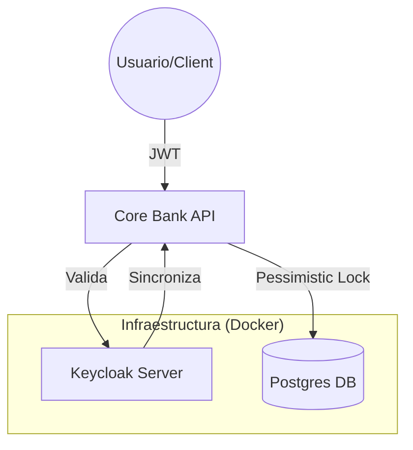

# Core Bank Project 🏦

Este proyecto es un sistema de **Core Bancario** de alto desempeño desarrollado con **Spring Boot**, diseñado para simular operaciones financieras reales con un enfoque crítico en la **integridad de datos**, **seguridad robusta** y **escalabilidad**.

## ✨ Características Principales

### 1. Seguridad Empresarial con Keycloak 🔐
*   **Identidad Centralizada**: Integración completa con **Keycloak** (OIDC/OAuth2) como Identity Provider.
*   **JIT Provisioning**: Los usuarios se sincronizan automáticamente con la base de datos local en su primer login, creando su perfil de `Customer` y su primera `Account` de ahorros de forma transparente.
*   **RBAC (Role Based Access Control)**: Roles de `ADMIN`, `TELLER` y `USER` sincronizados desde Keycloak para control de acceso granular en endpoints y UI.

### 2. Integridad Financiera y Concurrencia ⚖️
*   **Pessimistic Locking**: Implementación de `@Lock(LockModeType.PESSIMISTIC_WRITE)` en las transacciones críticas (depósitos y transferencias) para evitar "Lost Updates" en escenarios de alta concurrencia.
*   **Transaccionalidad ACID**: Asegura que las transferencias entre cuentas sean atómicas; o se completan ambos lados (débito/crédito) o no se hace nada.

### 3. Rendimiento Optimizado 🚀
*   **Entity Graphs**: Uso de `@EntityGraph` y `JOIN FETCH` para eliminar el problema de las consultas N+1, logrando que el dashboard se cargue con una sola consulta SQL optimizada.
*   **UUIDs**: Uso de identificadores universales para seguridad y facilidad de escalabilidad horizontal.

## 📊 Arquitectura del Sistema


```mermaid
graph TD
    User((Usuario/Client)) -->|JWT| API[Core Bank API]
    API -->|Valida| KC[Keycloak Server]
    API -->|Pessimistic Lock| DB[(Postgres DB)]
    KC -->|Sincroniza| API
    
    subgraph "Infraestructura (Docker)"
    KC
    DB
    end
```

## 🧪 Pruebas de Estrés (Stress Testing)

El sistema ha sido verificado usando **Apache JMeter** para garantizar estabilidad bajo carga:

*   **Escenario de Lectura (50 usuarios)**: 0% errores, latencia promedio de ~1.3s con carga de choque.
*   **Escenario de Escritura (100 transferencias concurrentes)**: 
    *   **Resultado**: ✅ 100% Integridad.
    *   **Verificación**: Se verificó mediante logs de Hibernate el uso de `FOR UPDATE` y la precisión matemática de los saldos finales post-estrés.

## 🛠 Tecnologías
*   **Java 17** & **Spring Boot 3**
*   **Spring Security** (OAuth2 Resource Server)
*   **Keycloak** (Identity & Access Management)
*   **Hibernate / Spring Data JPA**
*   **PostgreSQL**
*   **Docker & Docker Compose**
*   **Apache JMeter** (Performance Testing)

## 🚀 Cómo empezar

### 1. Requisitos
*   Docker y Docker Compose.
*   Java 17+.
*   Maven.

### 2. Levantar Infraestructura
```bash
docker compose up -d
```
Esto iniciará Keycloak y PostgreSQL con volúmenes persistentes.

### 3. Configurar Keycloak
El sistema espera un Realm llamado `BankaRealm` y un cliente `banka-client`. El usuario inicial es `admin` / `admin`.

### 4. Ejecutar el Backend
```bash
mvn spring-boot:run
```

### 5. Probar con JMeter
Importa los archivos `.jmx` incluidos en el repositorio para replicar las pruebas de estrés:
*   `stress_test.jmx`: Prueba de lectura (Dashboard).
*   `transfer_stress_test.jmx`: Prueba de escritura (Transferencias masivas).

---
Desarrollado con ❤️ para simular un entorno bancario real y seguro.
